# Image Semantic Segmentation Model Comparison on Oxford-IIIT Pet Dataset

## Problem Description 
    Image segmentation is helpful and useful in a variety of tasks dealing with images. Those tasks might be as trivial as the automatic optimization of color when we use our phones to take pictures every day, or as critical as identifying disease in an early stage on a medical image to significantly boost a patient's survival rate. In this project, I'm focusing on training and comparing different machine learning models’ ability to segment cats and dogs from all kinds of random backgrounds. Pet segmentation can be difficult due to their largely varied color that can be very similar to the background as well as all kinds of appearances and shapes (that they can curl their flexible body into). In this report, I will demonstrate the training process and the comparisons of the performance of 4 machine learning models.

## Dataset and Exploratory Data Analysis
    The [Oxford-IIIT Pet Dataset](https://www.robots.ox.ac.uk/~vgg/data/pets/) contains 7349 images of cats and dogs of 37 breeds, with around 200 images for each breed. Each image has a corresponding breed classification, head bounding box, and a pixel-level trimap segmentation that annotates each pixel to be one of: the pet body, outline of the pet body, and background. The images come in different shapes. By roughly looking at the dimensions of the images, most of their width and height are around 300 ~ 500 pixels. 

  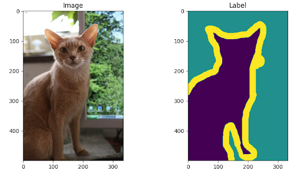

    To reduce computation costs when training and testing the models, I decided to downsize all images and the ground truth trimap annotations to 128x128 pixels and used nearest-neighbor interpolation when resizing. The nearest-neighbor interpolation divides the original image (before downsize) into [original length / downsize scale] sized blocks, then selects the top-left pixel from the block that matches the pixel position in the target image (after downsize) to be the target pixel at the position. This is the fastest interpolation method, but the target image may not be as smooth as if I chose the bilinear interpolation, which consults the top-left 4 neighbor pixels in the block and averages them to get the resulting pixel in the target image. However, I would like to reduce the computation cost, and also by checking the downsized images and trimaps, I think the images using the nearest-neighbor interpolation when scaled look pretty good, so I decided to stay with it. 

  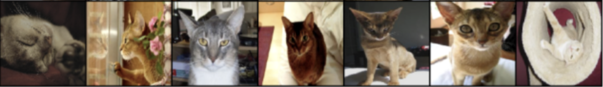
  

    I have also applied a random horizontal flip and color jitter for the purpose of data augmentation, aiming to increase the models’ generalizability after training. 
    
    From the sample images shown above, we can see that the samples in the dataset are mostly daily photos of the pets, and the pets are in all kinds of postures. By looking at the annotation alone, some are really hard to tell that it’s a pet (such as the leftmost and rightmost pictures above). Those annotations are really neat and detailed, the edges of the flower blocking in front of the cat in the second picture above are annotated as the outline of the pet body, and all the visible whiskers are annotated as outlines as well. We can foresee that it would be very difficult for a machine learning model to be able to classify such a detailed outline. In many pictures, the background is in color that is very close to the pet’s fur color or is messy with a lot of details, which increases the difficulty for the models to identify the pets. 
    
    The dataset was originally split almost evenly into a training and testing set. The training set contains 3680 photos while the testing set has 3669 photos. Because of the small number of samples in the training set, I decided to use all the training sets to train the models, and split 210 pictures from the testing set as validation sets, then use the rest for testing. I recognized that this is probably not the ideal way of splitting the dataset. I should have split out the validation set from the training set. I will revise our splitting if I continue to work on this project in the future. 
    
    I loaded every 64 pictures of the training set as a batch when training the models, and loaded every 21 pictures of the testing set as a batch when validating and testing. The batch size is set to be quite small to avoid taking too much space in the memory during runtime, and also to update the model parameters more frequently, because the model will run backpropagation and the parameters will get updated after running through every batch of training data. 

## Approach and Methodology
### Evaluation Metrics
    I first defined the evaluation metrics I'm going to use to evaluate and compare the performance of different models: pixel accuracy and IoU. 

#### Pixel Accuracy
    Pixel accuracy is self-explanatory by its name. It checks on every pixel for whether the predicted label matches the ground truth label, and outputs the percentage of pixels in the images that were predicted correctly. 
    
    Pixel accuracy may not reflect the accuracy of the model prediction very well, because it can be overly high especially when there is an imbalance issue in labels. For example, if only 5% of the pixels in an image belong to label A and the rest belong to label B, predicting all pixels as label B gives a high pixel accuracy of 95% even though the model is quite useless if it only knows to classify everything to the majority label. Nevertheless, the imbalance issue often occurs in image segmentation. As we can see in the pet dataset, the number of pixels that are classified as outlines are significantly lower than that for the pet body and background, but the outline is a very important label that the models should learn. That’s why I also used IoU as a metric during evaluation. 

#### IoU (Intersection over Union)

  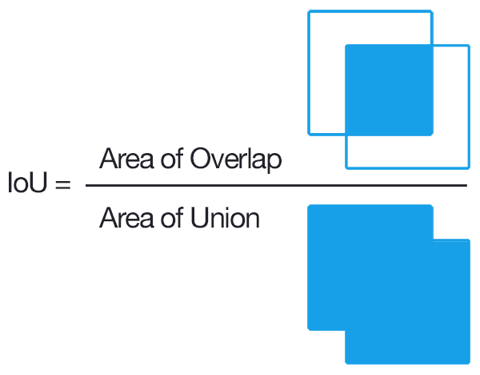

    IoU is a commonly used evaluation metric when working with pictures. It might be very easy to understand when using it to estimate the correctness of a bounding box in object detection tasks, but not so intuitive when it comes to pixel-level segmentation. 
    
    I used both a custom IoU function to find the <b>IoU for all 3 labels</b>, and a package-defined IoU function (TM.classification.BinaryJaccardIndex for logistic regression and TM.classification.MulticlassJaccardIndex for the other 3 models) to find the <b>IoU ignoring the background</b> which is a label I least care about.
    
    For the custom IoUMetric function, it first takes in a prediction tensor of shape (batch, channel, height, width). The channel equals the number of labels involved, which is 2 for binary classification, and 3 for all label classification for this dataset. Each of the channels contains a tensor matching the shape of the image, and each number in the tensor is the probability that the model thinks the corresponding pixels belong to one of the labels. It also takes in a ground truth tensor of shape (batch, 1, height, width), where each number in the tensor represents the ground truth label for the corresponding pixel. The last parameter this function takes in is indicating whether to apply a softmax inside the function. 
    
    IoUMetric first applies a softmax along the channel dimension on the prediction tensor (if the tensor hasn't performed a softmax already), meaning that the predicted probability for each pixel of all labels should sum to 1. Then it transforms the ground truth tensor to be in the shape of (batch, channel, height, width) as well, with each number being either 0 or 1 depending on whether the corresponding pixels belong to the label represented by the channel it is in. 

    It calculates the <b>intersection</b> by multiplying the transformed ground truth tensor and the prediction tensor, so that in the resulting tensor, only the probabilities in the correct label channel for each pixel will remain, and all wrongly predicted probabilities are cleared out as 0. It then calculates the <b>union</b> by adding the transformed ground truth tensor and the prediction tensor then subtracting the intersection tensor. Next, it sums the intersection tensor and union tensor across the last 3 dimensions, each resulting in a single number for each picture, then divides the intersection and union accumulated numbers to get IoU for each picture in the batch. Lastly, it takes the mean of the IoU of all pictures in the batch and gets an average batch IoU. 

    Below is a graph that I made based on my own understanding of why IoU would be a better metric than pixel accuracy:

  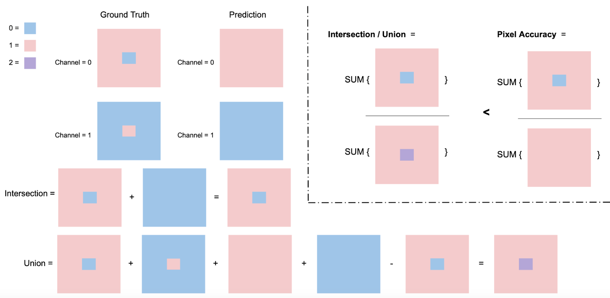

    Take the example that 90% of an image has label A, 10% has label B, and the model predicts 100% of the image to have label A. Pixel accuracy will give 90%, while the IoU will give 90/110 = 81.8%. IoU punishes more for the wrongly predicted pixels. 

### Machine Learning Models

    I worked with the following 4 models for this project: Logistic Regression, FCN (Fully Convolutional Network), U-net, and DeepLabV3+. Those models are of increasing complexity in their architecture, but not necessarily in their parameter amount. All the models are trained from scratch using the training set. I didn’t choose to use pre-trained models even though it might be a general practice to use a pre-trained encoder for models such as FCN. I would like to see how those models perform using only the small training set that we have. 

#### Logistic Regression
    I started off with logistic regression, which is the simplest model I can think of, to be the baseline model. 

    For each photo, I transformed the photo from (batch, channel, height, width) to (batch, height * width, channels), so that in the last dimension, each row of 3 values represents the RGB for the pixel represented by the row, to be ready to pass into the logistic regression model. 

    The model basically comprises a linear layer with 3 input channels and 1 output channel (the predicted class probability), then the output of the linear layer goes into a sigmoid function to become the final output. This model has 4 parameters because the linear layer implies a W matrix of shape 3*1 and a single bias. 

    Logistic regression is usually used for binary classification, so I edited the ground truth labels to merge the outline pixel to have the same label as the pet body, and the image pixels now have 2 classes: 0 = pet body + outline, 1 = background. 

    I trained multiple logistic regression models and found that they can vary a lot in their prediction. That is probably because of the shuffle of the training set images, while also because there is no real pattern of color that the model can really learn to distinguish between a pet and a background. The trained models generally fall in one of the 3 outcomes:

1. Predicts almost all pixels to belong to a background (maybe because the background class dominates the number of pixels)

2. Predicts almost all dark-color pixels in the image to belong to a pet

3. Predicts almost all dark-color pixels in the image to belong to a background

    The 3 possible outcomes show that there is no real pattern that the logistic regression can find to distinguish between a pet body and a background pixel solely by the pixel color. The only thing that the model is able to do is to either predict all pixels into the dominant class to aim for a relatively lower loss, or classify pixels by the lightness of the original color which sometimes can accidentally match some of the pixels to the right class. This is expected, as there is rarely a color that only appears either in a background or in a pet but not both. 

    Below is a visualization of the original images, ground truth labels, and the predicted labels by a logistics regression model for the first 21 pictures in the validation set. This shows an example that the model classifies the dark pixels as pet bodies, and pixels that are very close to white as the background. We can see that this kind of classification worked for the third picture from the right on the top row, where the cat with darker fur color (also even darkened by shadow) is in front of a completely white background. However, such a photo-ID-like picture is rare, especially for pets. Also, what if a white cat or dog is in front of a black background? Then this model would predict exactly the opposite, mistakenly taking the black background as the pet and the white-fur pet as the background. We can see below that none of the predictions for the other 20 pictures make much sense. 

  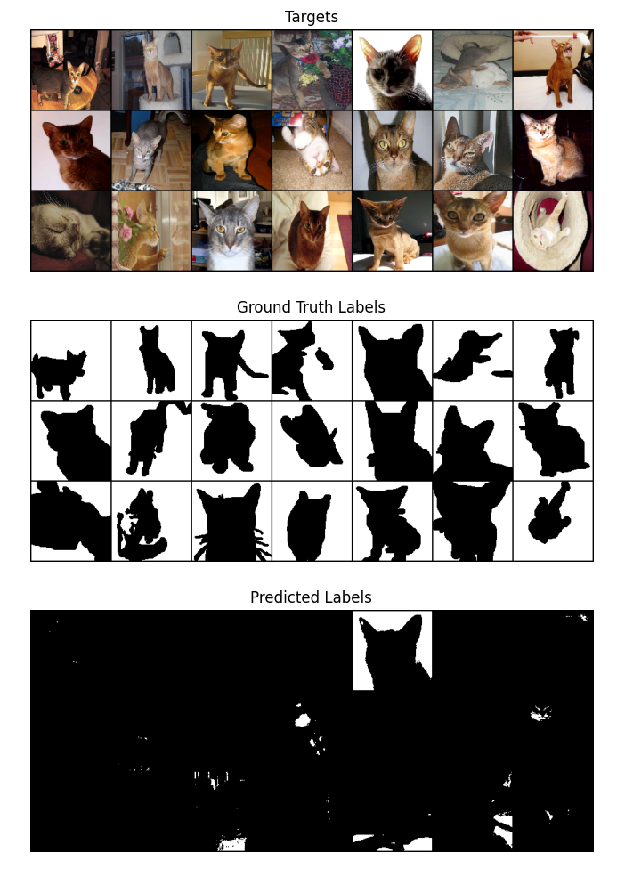

    Here is a plot for the change of IoU of all class labels in the entire validation dataset during each training epoch:

  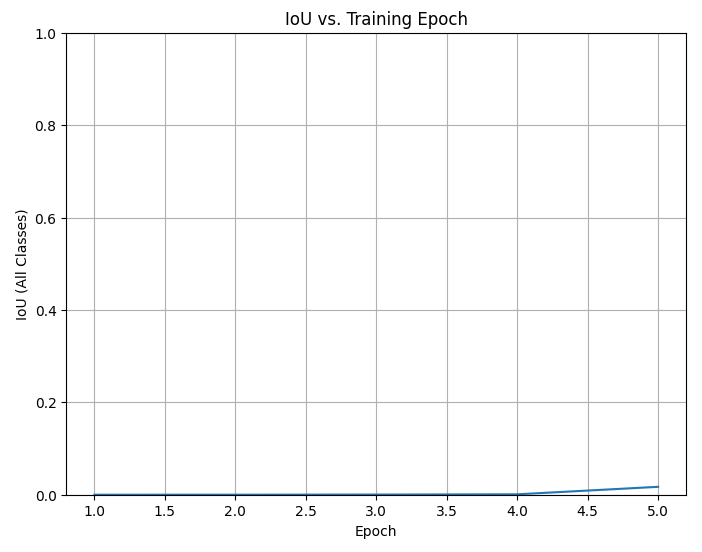

    This shows that using logistic regression to complete an image segmentation task based on pixel color is very unreliable. So I looked into deep neural networks next.

#### FCN (Fully Convolutional Network)

  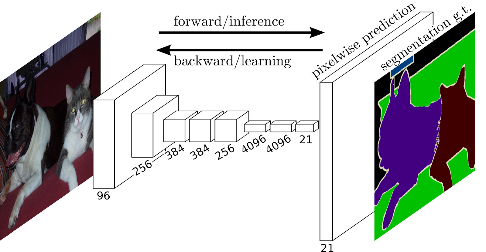
  (Above is an example diagram of the FCN model in the original paper, 
the hyperparameters are not the same as what I implemented)

    FCN was proposed by Long et al. at CVPR 2015. When implementing the FCN, for comparison purposes, I made its encoder to be the same as the U-net’s encoder. 
    
    Our FCN’s architecture is quite simple. Its encoder comprises 5 layers, each having 2 convolutional layers with a 3x3 kernel and a padding of 1, and a max pool layer with a 2x2 kernel and a stride of 2. Each layer roughly doubled the channels and reduced the size of the input tensor by half. The encoder aims to learn the information contained in the input picture. Then it is followed by a decoder with a single transposed convolutional layer with a 16x16 kernel and also a stride of 16. This layer is meant to translate the information learned into a decreased number of channels each having a tensor that is the same size as the original input picture. The output from the transposed convolutional layer performed a batch normalization then went into a 1x1 convolutional layer to further decrease the number of channels to be the same as the number of classes. In this case, the final output is of shape (batch, 3, height, width), because we are classifying each pixel into each of the 3 classes. Each value in the tensors is the model’s prediction of the probability that the corresponding pixel belongs to the class represented by the current channel. 
    
    Even though the model’s architecture looks simple, it contains around 1.3 million parameters, which is the highest among all the models I'm comparing. Its transposed convolutional layer in the decoder alone has about 128 * 32 * 16 *16 = 1048576 ≈ 1 million parameters. Maybe from the help of its massive amount of parameters, its learning ability is great. Below is the prediction made from an FCN model trained for 50 epochs on the first 21 validation pictures as well as a plot showing the validation IoU changes during training. We can see that the IoU, though changing slowly, is still showing an upward trend after 50 epochs. This means that we can try to extend the number of epochs trained to see when it can reach its optimal number of epochs to both learn the patterns but not overfit the training set. 

  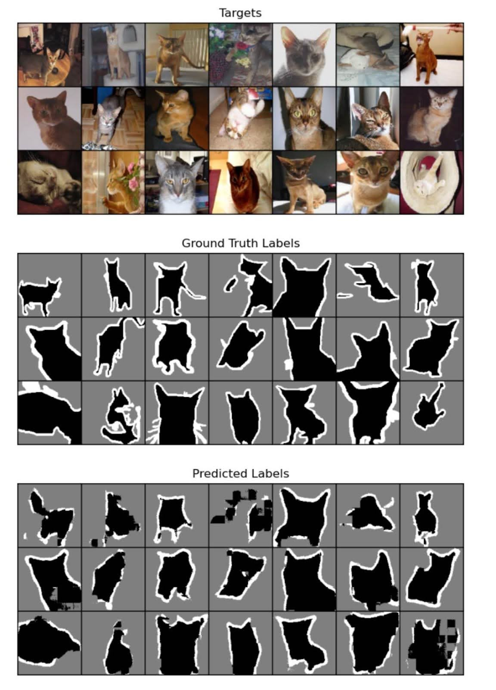
  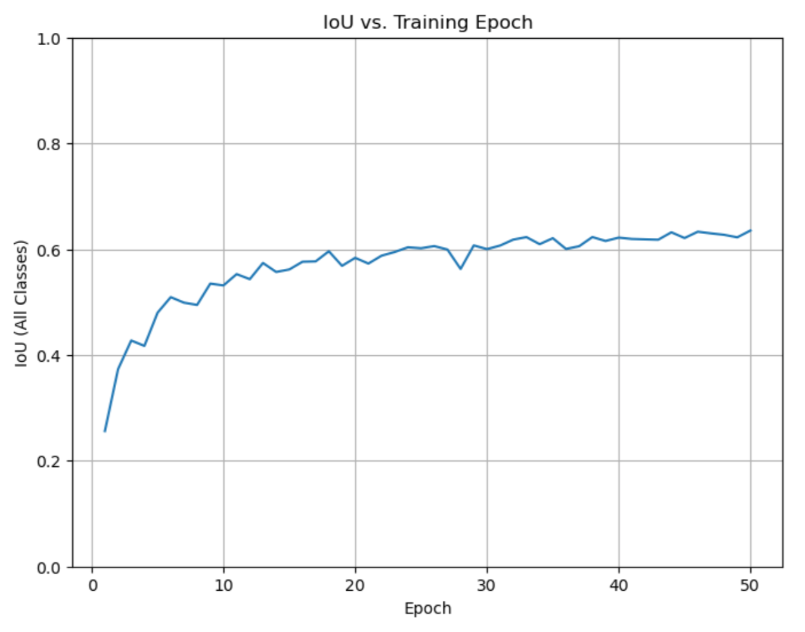

    This demonstrates that FCN is a simple architected but a very powerful model in image segmentation tasks.

#### U-Net

  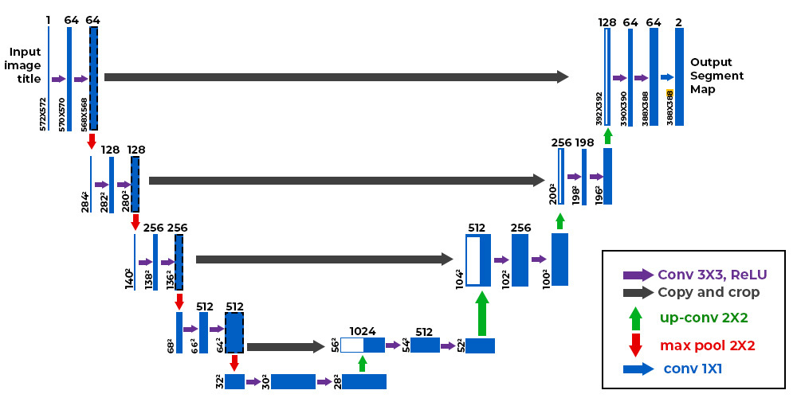
  (Above is an example diagram of the U-net model in the original paper, 
the hyperparameters are not the same as what I set)

    U-net was proposed by Ronneberger et al. at MICCAI 2015. Its architecture is quite similar to a FCN model, the main difference lies in their decoders. That’s why we directly used the same encoder structure for both U-net and FCN. Each decoder block in U-net contains:
    
1. a transposed convolutional layer to double the size of the tensors with the kernel size and stride both being 2, and decrease the channels by half. 
2. 1st convolutional layer with a 3x3 kernel, padding of 1, and decreases channel size by half. This layer’s output tensor has the same size as the input except for the channel dimension.
3. 2nd convolutional layer with a 3x3 kernel, a padding of 1, with the channel size stays the same. This layer’s output tensor has the same size as the input.

    The second layer (aka the first convolutional layer) in a decoder block takes in a concatenation of:

1. the output of the last convolutional layer in the corresponding encoder block (before entering the pooling layer), and 
2. the output from the previous transposed convolutional layer

    Those 2 output tensors are of the same shape: (batch, channel, height, width), and they are concatenated along the channel dimension. After concatenation, the channel dimensions doubled. That’s why both the transposed convolutional layer and the first convolutional layer in the decoder block decreased the channel size by half, but overall, a single decoder block only decreases the channel size by half but not a fourth. 
	
    There are 4 decoder blocks, then the output passed into a 1x1 convolutional layer decreases the channel size to be the same as the number of classes for prediction (which is 3 in our case). 

    The U-net model has a slightly more complicated architecture when compared to FCN, but its number of parameters is actually less than 0.5 million, and is almost ⅓ of the FCN’s parameter count. Despite its significantly lower parameter count, its learning ability doesn’t differ much from the FCN. Below are the visualization of the first 21 validation pictures and the model’s prediction after 50 training epochs, as well as the plot for the change in all class IoU on the entire validation set during training. 

  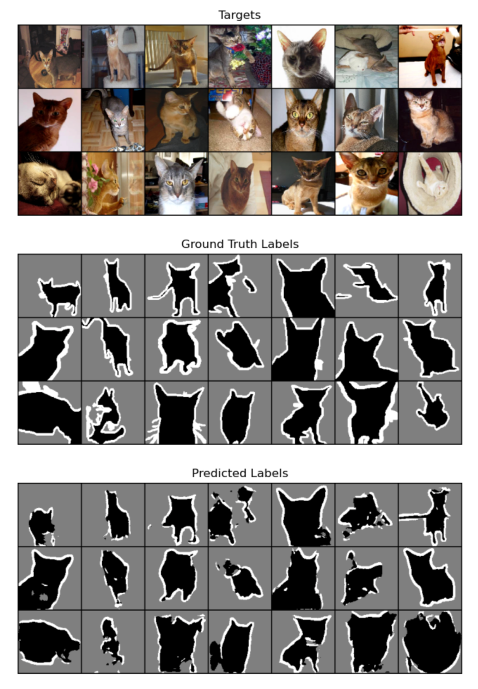
  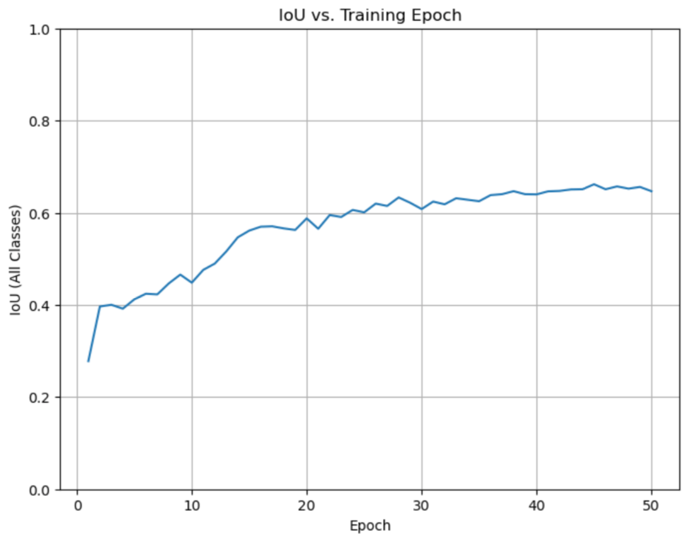

    From the plot, it’s a little hard to tell if the trend is heading downward at the end when reaching the 50th epoch. We certainly can try extending the training epochs to pass 50 to see if this is already the optimal number of training epochs. 

#### DeepLabV3+

  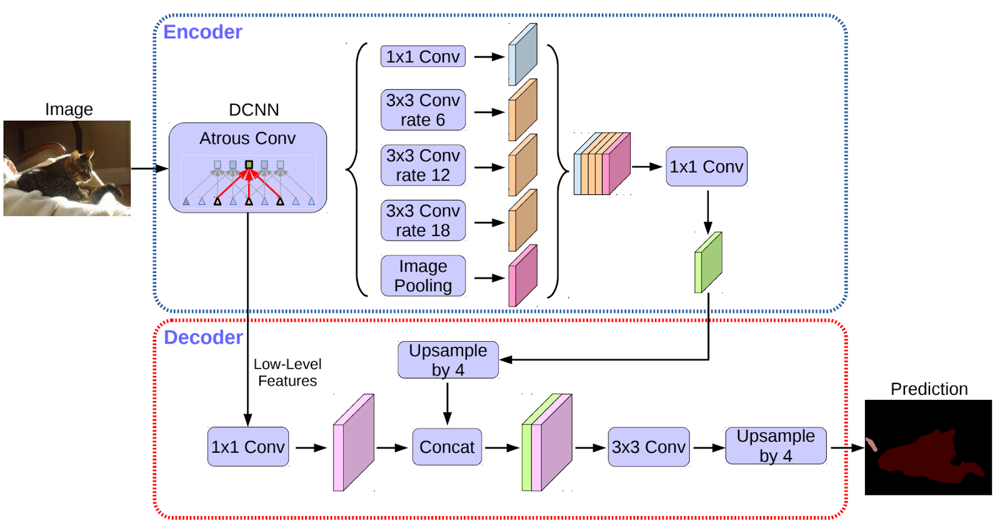
  (Above is an example diagram of the DeepLabV3+ model in the original paper, 
the hyperparameters are not the same as what I set)

    DeepLabV3+ was proposed by Chen et al. at ECCV 2018, following a series of DeepLab models since the first publication of DeepLabV1 at IEEE Xplore in 2017. Its architecture is quite complicated but the inside is not complex. It uses a large number of blocks each containing a convolutional layer, a batch normalization, and a ReLU activation. By adjusting the kernel size, stride, padding, and dilation hyperparameters of the convolutional layer, those blocks can be used for different purposes. 
    
    The most interesting part of this model, which is also what the above diagram is actually emphasizing, is the atrous spatial pyramid pooling (ASPP) block. An ASPP block contains:

1. A 1x1 convolutional layer which decreases the number of channels.
2. A series of convolutional layers with a kernel size of 3 and a padding of 1, with padding equals dilation to ensure the output dimensions for height and width stay the same (dilation depends on input hyperparameters, and the numbers usually come in increasing order).
3. An image pooling layer that calculates a global average pooling that reduces all channels to have a sub-tensor of 1x1, and uses another 1x1 convolutional to decrease the number of channels channel, then expands the sub-tensors in each channel back to the original size of each image. 

    Each of the above-mentioned layers is individually used on the input tensor, then all the outputs are concatenated together along the channel dimension to input into the next part of the model. 
    
    By using an ASPP layer, the series of convolutional layers each with different but increasing numbers of dilation can summarize information from pixels that are many steps away from the current focusing pixel.

  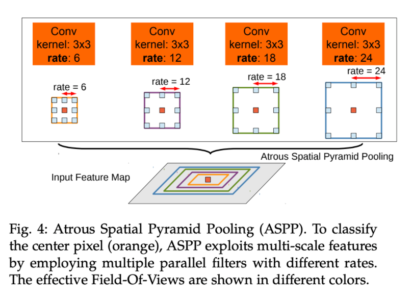

    The hyperparameters for the dilations in the original DeepLabV3+ model are the same as the “rate” values in the above diagram. Even though the ASPP can be powerful, the original hyperparameters might be too large when dealing with a small image of size 128x128. I have tried to run the model with the original hyperparameters. The result doesn’t look good such that the model can’t seem to be able to distinguish the pet. The model would either label an overly large span of pixels to be a pet if the pet takes up significant space in the image or can’t distinguish if there is a pet in the image at all if the pet is quite small in the image. I thought it might be caused by the overly large dilations used, such that the model is looking too far when classifying a pixel which blurred the true meaning of this pixel. So I tried to lower many of the dilation hyperparameters. I also lowered the number of blocks used because I think the dataset isn’t very large, a large model is not really needed, and it may not be able to support the training of a very large model to perform well. 
    
    Knowing that this model has a larger and more complicated architecture, I expected it to need more training epochs in order to be fully trained to perform well. Before looking at the actual number of parameters that this model has, I thought that it would be higher than that of FCN. But its parameter count is only about half of the FCN’s parameter amount. My guess was correct though, it indeed needs more training epochs to be performant. Below shows a visualization of the first 21 validation set pictures with their actual and predicted labels after 100 training epochs. There is also a plot showing all class IoU versus training epochs. From the plot, We can see that the models’ IoU was around 0.5 when the number of training epochs reaches 50, but that number for FCN and U-net models was above 0.6 when they were trained for 50 epochs. 

  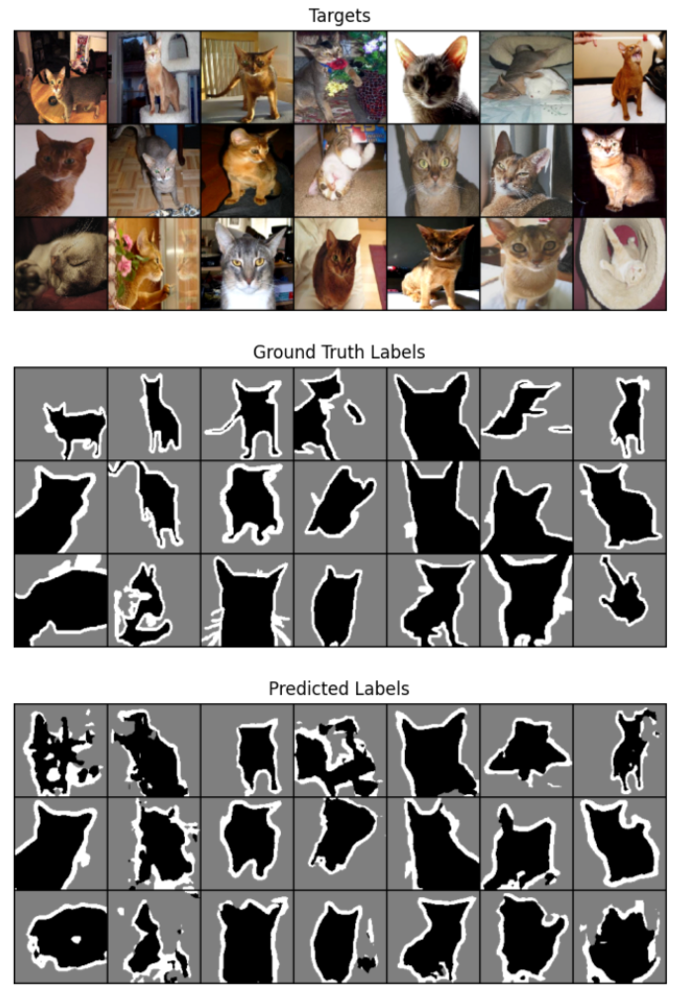
  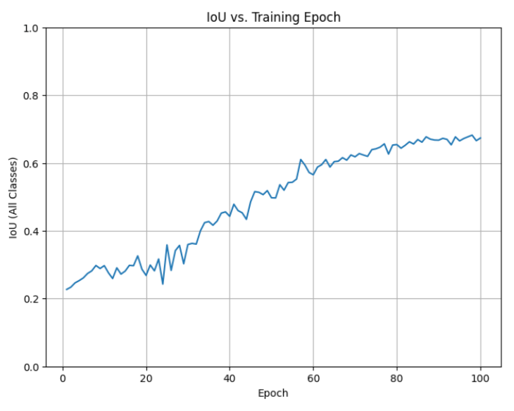

   

    The big fluctuations in the plot when the number of training epochs is below 30 is also something I always notice when I'm training this model for various hyperparameters. I have visualized the predicted labels on the first 21 validation images for every epoch and found that this is because the model’s prediction when it is trained for less than 30 epochs is generally very weird and seems like it is hardly learning anything. 
    
    Here is when the model was trained for 15 epochs:
    

  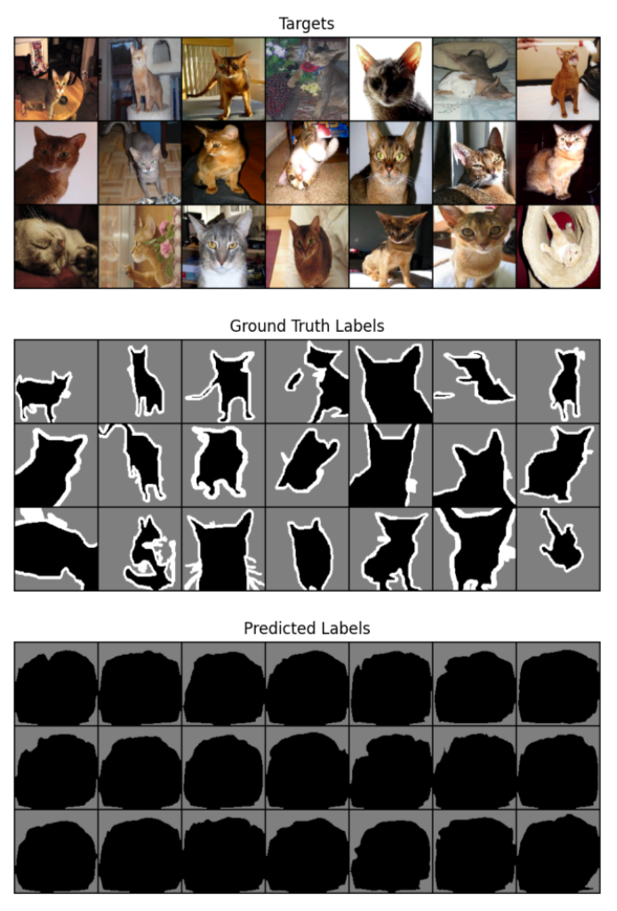

   

    And when the number of epochs reached 27:

  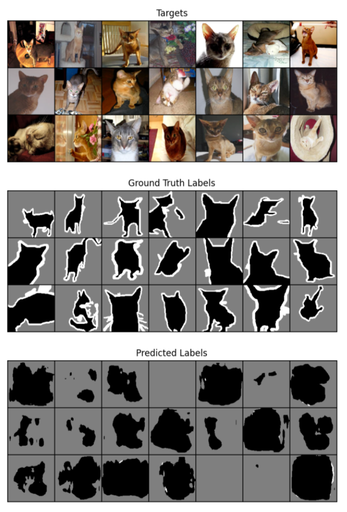

   

    This demonstrates that DeepLabV3+ has the ability to classify pixels but does require a good number of training epochs.

## Discussion and Result Interpretation

    The following chart shows some important hyperparameters for each model as well as their performance on the entire testing set:
    
Models | Logistic Regression | FCN | U-Net | DeepLabV3+
|------|---------------------|-----|-------|----------|
#Parameters | 4 | 1343819 (≈ 1.3M) | 485835 (≈ 0.5M) | 691835 (≈ 0.7M)
#Epochs | 5 | 50 | 50 | 100
Learning Rate | 0.0001 | 0.001 | 0.002 | 0.001
Scheduler | None | StepLR: Decrease by 10% every 10 epochs | StepLR: Decrease by 10% every 10 epochs | StepLR: Decrease by 10% every 10 epochs
Pixel Accuracy | 0.5777 / 0.4333 | <b>0.8475</b> | 0.8421 | 0.8419 
IoU (All Classes) | 0.3333 / 0.0192 | 0.6721 | 0.6547 | <b>0.6977</b>
IoU (Ignore Background) | 0 / 0.9840 | 0.6419 | 0.6248 | <b>0.6795</b>

\* Note that because the Logistic Regression behaves very differently even with the same hyperparameters, I decided to report both the resulting metrics when it classifies all pixels into a background (the first numbers in the metrics field), and when it classifies almost all pixels as a pet (the second numbers in the metrics field).

\** The highest number for each testing metric is bolded (ignoring the metrics for the logistic regression model since it is actually not learning much). 

    The logistic regression model is very unreliable, showing that trying to distinguish pet and background solely by color is not a good approach. This makes us appreciate the emergence of the deep neural networks that we are going to talk about next which can actually learn the patterns in the picture to classify pixels.

    The 3 deep neural network models have pretty similar performance. They all can classify around 84% of pixels in an image correctly and have an IoU between 0.6 and 0.7. The DeepLabV3+ model outperformed the other two for both IoU metrics, with FCN ranked second, and U-Net being the last. The FCN and U-Net models both deviate about 0.02~0.03 in their IoU values with that of the model directly ranked before them. 
    
    This demonstrates that the DeepLabV3+ model performs slightly better than the other two models. While we should be aware that the DeepLabV3+ model requires more training epochs in order to perform well as explained in the above section. 

    The FCN model is performing slightly lower than the DeepLabV3+ model but it requires less training epochs. We have tried different training epochs, and find that it actually performs quite well after training just 20 epochs. The powerfulness of FCN, as mentioned in the above section, might come from its huge number of parameters. At first, I didn’t check for the model’s parameter amount and mistakenly thought that because the FCN model’s architecture looks simple, it should be a “simple model” with fewer parameters. 

    The U-net model ranked last in its IoU performance, but it actually didn’t differ that much from the other two. We should notice that it has the least parameter amount among the 3 deep neural networks, which might have restricted its learning ability. 

    Overall, the 3 deep neural networks all performed quite well, and each has its pros and cons. All of those models are runnable using a laptop’s CPU and take several hours to train. I have run all of the models in the Jupyter Notebook locally on my laptop. I tried to run them with Google Colab’s GPU, and it can indeed significantly speed up the training, but because its connection is not stable. Sometimes it takes a long time to get an available resource to actually start the training but might be disconnected after a short period of time, so I have been relying on my laptop's CPU during the later stages of this project. Due to resource and time limitations, I wasn’t able to do a very detailed fine-tuning and chose the hyperparameters mostly out of my own intuition.

## References
Parkhi , Omkar M, et al. “The Oxford-IIIT Pet Dataset.” Visual Geometry Group - University of Oxford, 
2012, www.robots.ox.ac.uk/~vgg/data/pets/. 

Long, Jonathan, Evan Shelhamer, and Trevor Darrell. "Fully convolutional networks for semantic 
segmentation." Proceedings of the IEEE conference on computer vision and pattern recognition. 2015.

Ronneberger, Olaf, Philipp Fischer, and Thomas Brox. "U-net: Convolutional networks for biomedical 
image segmentation." Medical image computing and computer-assisted intervention–MICCAI 2015: 18th international conference, Munich, Germany, October 5-9, 2015, proceedings, part III 18. Springer International Publishing, 2015.

Chen, Liang-Chieh, et al. "Encoder-decoder with atrous separable convolution for semantic image 
segmentation." Proceedings of the European conference on computer vision (ECCV). 2018.

Chen, Liang-Chieh, et al. "Deeplab: Semantic image segmentation with deep convolutional nets, atrous 
convolution, and fully connected crfs." IEEE transactions on pattern analysis and machine intelligence 40.4 (2017): 834-848.

L. -C. Chen, G. Papandreou, I. Kokkinos, K. Murphy and A. L. Yuille, "DeepLab: Semantic Image 
Segmentation with Deep Convolutional Nets, Atrous Convolution, and Fully Connected CRFs," in IEEE Transactions on Pattern Analysis and Machine Intelligence, vol. 40, no. 4, pp. 834-848, 1 April 2018, doi: 10.1109/TPAMI.2017.2699184.

Sahu, Beeren. “The Evolution of Deeplab for Semantic Segmentation.” Medium, Towards Data Science, 
12 July 2019, towardsdatascience.com/the-evolution-of-deeplab-for-semantic-segmentation-95082b025571.  

#### Open-source code referenced:

https://www.kaggle.com/code/dhruv4930/oxford-iiit-pets-segmentation-using-pytorch

https://github.com/aamini/introtodeeplearning/blob/master/lab2/Part1_MNIST.ipynb

https://towardsdatascience.com/cook-your-first-u-net-in-pytorch-b3297a844cf3

https://github.com/kazuto1011/deeplab-pytorch

